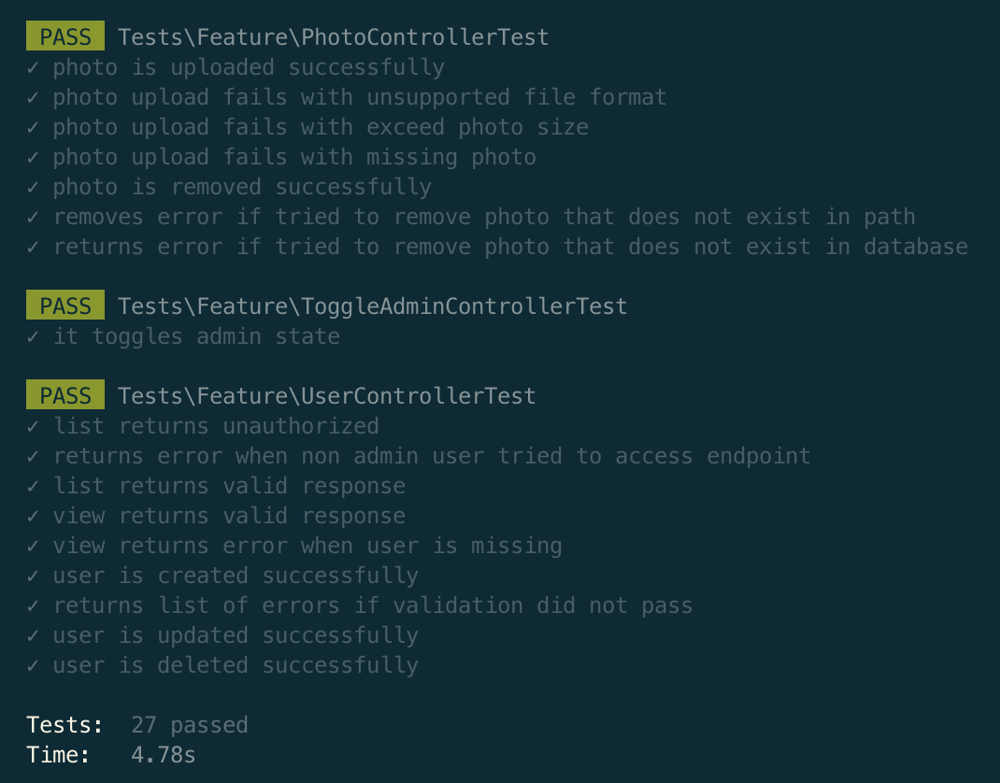

# THEAM CRM API Service

CRM API Service used to manage customers.

## Getting Started

These instructions will get you a copy of the project up and running on your local machine for development and testing purposes.

### Prerequisites

Things you will need:

- [PHP](https://www.php.net/downloads.php)
- [Composer](https://getcomposer.org/download/)
- [Docker](https://docs.docker.com/get-docker/) (not required)
- [Valet](https://laravel.com/docs/8.x/valet) (not required)
  - [Valet +](https://github.com/weprovide/valet-plus)

Things you might need to test API:
- [Postman](https://www.postman.com/downloads/)
- [Insomnia](https://insomnia.rest/download)

Or you can use [hoppscotch](https://hoppscotch.io/)!

#### If you are not going to use Docker make sure you have all required PHP extensions installed on your local machine https://laravel.com/docs/8.x/deployment#server-requirements

## Environment Variables

To run this project, you will need to add the following environment variables to your `.env` file

`GITHUB_CLIENT_ID`
`GITHUB_CLIENT_SECRET`

#### To get those values you have to create github OAuth application. Folow [Github docs](https://docs.github.com/en/developers/apps/building-oauth-apps/creating-an-oauth-app) to create OAuth application.

For authorization callback use your local app url <http://theam_crm.test/api/v1/auth/github/callback> if you are running app locally using Valet / Valet +.
Or <http://127.0.0.1:8000/api/v1/auth/github/callback> if you are running app in Docker or using built-in server.

## Installation

Clone the project

```bash
  git clone git@github.com:Fecony/theam_crm.git
```

Go to the project directory

```bash
  cd theam_crm
```

Install dependencies

```bash
  composer install
```

Copy .env.example file to .env on the root folder.

```bash
  cp .env.example .env
```

## Run Locally

Run `php artisan key:generate` to generate app key.

Run `php artisan storage:link` to create the symbolic link.

> If you are running Docker, you can use the same commands but swap `php` to `sail`.

#### Docker

By default application is configured to run in Docker container. You don't have to change any environment configuration setting.
To run app in Docker container make sure that Docker is running.
Then run Laravel Sail command to run Docker in background:

```bash
  ./vendor/bin/sail up -d
```

After you application is running in Docker container run `sail artisan migrate` to run migration files.

### Running application locally without Docker

To run application locally you have to change your `.env` file mysql settings. Change following settings to match you local mysql settings:

```bash
DB_HOST=127.0.0.1
DB_PORT=3306

# Change this settings to match you database name and mysql user
DB_DATABASE=laravel
DB_USERNAME=sail
DB_PASSWORD=password
```

Then run `php artisan migrate` to run migration files.

#### Valet / Valet +

Valet is a Laravel development environment for macOS minimalists. You can use it to run Laravel application locally.
Read more about Valet here: https://laravel.com/docs/8.x/valet

Also you can use [Valet plus](https://github.com/weprovide/valet-plus) that is more powerful version of Laravel Valet.
Follow Valet docs to park and link you application. After that you will be able to access it by visiting <http://theam_crm.test/>

#### Laravel built-in server

To run application using Laravel built in server run following artisan command:

```bash
  php artisan serve
```

Then you can access you app running on <http://127.0.0.1:8000>

## Authorization flow ✨

In order to access protected API endpoints you have to authentication user by using "Github Authentication" - `api/v1/auth/github` endpoint.
You will get url that user has to visit in order to give us access to his Github Account. After successful authentication user will be redirected and you will receive user basic information with token that you have to use for authorization.

> Example response: 

```
"user": {
  "id": 1,
  "email": "example@example.com",
  "username": "Github username",
  "is_admin": false
},
"token": "BEARER TOKEN"
```

#### To authenticate requests, include an Authorization header with the value "Bearer {BEARER TOKEN}".

## Running Tests

Tests are running in sqlite database. You can download it [here](https://www.sqlite.org/download.html) 

To run tests you have to create `.env.testing` file:

```bash
  cp .env .env.testing
```

set following environment variables:

```bash
  APP_ENV=testing

  DB_CONNECTION=sqlite
  DB_HOST=null
  DB_PORT=null
  DB_DATABASE=:memory:
  DB_USERNAME=null
  DB_PASSWORD=null
  
  GITHUB_CLIENT_ID=test
  GITHUB_CLIENT_SECRET=test
```

Then you can run `composer test` command to run tests using PHPUnit.

Or you can run `php artisan test` to see fancy output ✨

If everything is fine you will see happy tests output 🧪


#### Docker

After starting Docker container by running `./vendor/bin/sail up -d` you can run `sail test` to run tests.

## Documentation

You can view deployed version of docs at [Github Pages](https://fecony.github.io/theam_crm/)

To regenerate docs run:

```bash
  php artisan scribe:generate
```
Also you can find Postman collection by visiting /docs.postman.

## Authors

- [@fecony](https://www.github.com/fecony)

## Acknowledgements

- Thanks to Taylor Otwell for creating Laravel ✨
- [Readme generator](https://readme.so/)

## Support

For support, contact me [@fecony](https://www.github.com/fecony).

## License

[MIT](https://choosealicense.com/licenses/mit/)
